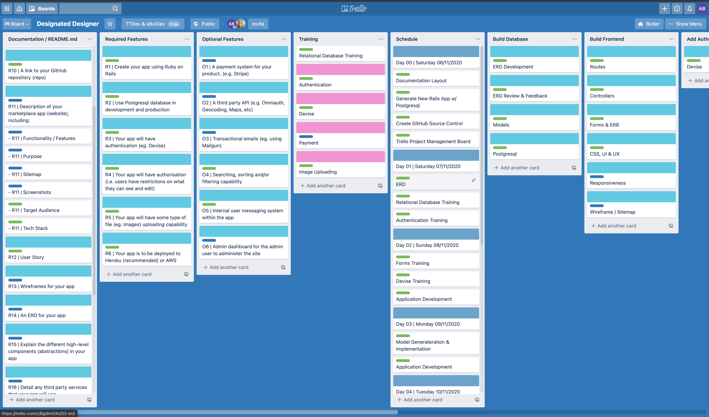

### @aBuiDev's
# Designated Designer

<br>

## **R7** | Identification of the problem you are trying to solve by building this particular marketplace app:
####

There is a huge problem in the design industry where the working environment of most designers fall into a toxic category. This is due to marketing and design being a sub-category of a company that doesn't generate revenue or lack of understanding by employers on the importance of good design and the value towards a brand a good designer can offer. It is well known that design is an extremely challenging profession that requires patience and strong contextual as well as conceptual thinking. The core value a designer can bring is towards branding and identity, where a designer can visually generate a company's persona, allowing both external and internal stakeholders to identify with a company on an interpersonal level. This is the power a designer can offer, however in the industry it is often over-looked and misunderstood. 

<br>

This market place will be implemented as "designer focused" and help designers to focus on their passion of design with more "design" wins as completed projects. Projects will be delivered through an interactive portal where designers can choose what project they want to work on and chat in real time with the client via a built-in messaging interface. No physical interaction or contact will be required to get the job done as the client and designer both have to work together to get the final design approved. This level of collaboration is something missing in the professional designers are often left with obscure briefs to do everything themselves and return a semi polished draft for review. Often, designers are left to chase up clients to review work for a project they have created. Through this two work marketplace as a service, projects don't move forward unless the other party does their part.

#

<br>

## **R8** | Why is it a problem that needs solving?:
####

**The problem:**

The design profession is extremely challenging on many levels including technical, interpersonally and emotionally. To be a good designer you need to be able to wear many hats and think conceptually within context, however, even reaching this level of design thinking, methodology and practice often leaves the designer with rewards that don't match with their quality as a designer. This generally leaves the designer in a burned out state where they're unable to sometimes move forward and contemplate a career change into full stack web development. 

**The solution:**

Designated Designer is a middle management two way market web application between client and designer that forces both parties to collaborate with one another through an interactive interface. It is a designer focused medium that makes sure that clients understand that they need to also collaborate with the designer to get the job done. These collaboration is done through a real time chat system as well as real time interface/HUD that communicates the different stages of the project via updated status of key areas of design development.

#

<br>

## **R9** | A link (URL) to your deployed app (i.e. website):
####

[Designated Designer HEROKU Deployment](https://abuidevs-designated-designer.herokuapp.com/)

#

<br>

## **R10** | A link to your GitHub repository (repo):
####

[Designated Designer GitHub Repo](https://github.com/aBuiDev/aBuiDevs_Designated_Designer.git)

#

<br>

## **R11** | Description of your marketplace app (website), including:

<br>

- **Purpose:**

<br>

- **Functionality / features:**

<br>

- **Sitemap:**

<br>

- **Screenshots:**

<br>

- **Target audience:**

    Target audience includes:
    - Gamers
    - PC Enthusiasts
    - Hobbyist PC Builders
    - Computer Modders
    - Savvy Consumers
    - Consumer looking for a good deal
    - Consumer looking for computer parts

<br>

- **Tech stack (e.g. html, css, deployment platform, etc):**

<br>

**Front-end Development:** HTML5, CSS3, SCSS, Embedded Ruby.

**Back-end Development:** Ruby Version 2.7.1, Ruby on Rails Version 6.0.3.

**Database:** Postgresql Database Management System

**Deployment:** Heroku

**Additional:** Devise and AWS S3.

**Development, Planning and Version Control:** Gitbash, Terminal, Github, VS Code, Trello, macOS and Windows 10.

<br>

####

#

<br>

## **R12** | User stories for your app:
####

**USER:** <br>

- As a user, I want to feel unique and only identified by my username or user ID.
- As a user, I want to have control of all my account details with regards to what people can and cannot see.
- As a user, I want to feel like my identity and my details are safe.
- As a user, I want my identity to remain anonymous, so that I can design for clients without having to put 
- As a user, I want to be able to easily logout of my account.
- As a user, I don't want anyone else to be able to access my account but me.
- As a user, I want to feel part of a positive online community.

<br>

**CLIENT:** <br>

- As a client, I want to switch between being a client or designer seamlessly.
- As a client, I want to easily log into my account using my email, username or mobile as well as a password.
- As a client, I do not want to be distinguished as either a buyer or seller but as both.
- As a client, I want a streamlined and easy client and designer interaction experience.
- As a client, I want to know that I can trust other users who are both designers or clients.
- As a client, I want to easily communicate with a designer of my project.
- As a client, I want to easily communicate with a designer through an interactive and intuitive interface.
- As a client, I want to easily create a project and understand that every project needs a proper description

<br>

**DESIGNER:** <br>

- As a designer, I want to switch between being a buyer or seller seamlessly.
- As a seller, I want to easily log into my account using my email, username or mobile as well as a password.
- As a seller, I want do not want to be distinguished as either a buyer or seller but as both.
- As a seller, I want to be able to let other users know if I am willing to trade the item I have up for sale or not.
- As a seller, I want to be able to easily delete or edit my listing.
- As a seller, I want a streamlined and easy selling experience.
- As a seller, I want to know that I can trust other users.
- As a seller, I want to easily communicate with a listings seller.
- As a seller, I want to be able to easily view my transaction history.

<br>

#

<br>

## **R13** | Wireframes for your app:
####

#

<br>

## **R14** | An ERD for your app:
####


#

<br>

## **R15** | Explain the different high-level components (abstractions) in your app:
####

#

<>

<br>

## **R16** | Detail any third party services that your app will use:
####

* Devise
  - Devise was implemented for user management and authorisation. Devise was used to generate a user model that aided me in writing conditionals using ```current_user``` and ```user_logged_in?``` to output different elements that can be used by the current user and their client/designer association.

AWS S3: AWS S3 is used for image uploading and storage for listings in the app. These images are then stored in the cloud, removing the need for in app storage.

Bootstrap: Bootstrap is a framework used for front end styling. It uses a combination of CSS and Javascript to provide easy styling functions in the embedded Ruby files.

#

<br>

## **R17** | Describe your projects models in terms of the relationships (active record associations) they have with each other:
####

<br>

* The user mode; is the main model where most associations will be able to reference the user to gain access to user information like projects they have available to be worked on or projects they have already worked on. This also includes access to the username which can be outputted in many different areas like the messages and project information.

* The project model is the main model where all users and data collaborate together to create an interactive interface. The user model becomes associated with a designer or client model that become associated with this project and can then interact with one another through the project model. The messaging model is also associated with the projects model allowing users as designers or clients to interact with one another though the projects model.

* Message models belong to the chatbox model and populated the chatbox model where the message data is outputted onto a chat interface through the projects model.

* The designer model belongs to the user model and is what allows the web application to formulate conditionals related to designer/client/user data output/input for all the other models, specifically the messaging and projects models. 

* The client model belongs to the user model and is what allows the web application to formulate conditionals related to client/designer/user data output/input for all the other models, specifically the messaging and projects models. 

* The chatbox model belongs to the projects model and has many messages that can be stored into the chatbox table, the messages can the be used to display message data through the projects model. 

<br>

* user
  - has_one :designer
  - has_one :client
  - has_one :detail
  - has_one :address

* project
  - belongs_to :client
  - belongs_to :designer, optional: true
  - has_one_attached :picture
  - has_one :chatbox

* message
  - belongs_to :chatbox

* detail
  - belongs_to :user

* designer
  - belongs_to :user
  - has_one :project
  - has_many :messages

* client
  - belongs_to :user
  - has_many :projects
  - has_many :messages

* chatbox
  - belongs_to :projects
  - has_many :messages

* address
  - belongs_to :user

#

<br>
<br>
<br>

## **R18** | Discuss the database relations to be implemented in your application:
####

<br>

```ruby
class User < ApplicationRecord
  has_one :designer
  has_one :client
  has_one :detail
  has_one :address
end
```
* The user mode; is the main model where most associations will be able to reference the user to gain access to user information like projects they have available to be worked on or projects they have already worked on. This also includes access to the username which can be outputted in many different areas like the messages and project information.

<br>
<br>

```ruby
class Project < ApplicationRecord
  belongs_to :client
  belongs_to :designer, optional: true
  has_one_attached :picture
  has_one :chatbox
end
```
* The project model is the main model where all users and data collaborate together to create an interactive interface. The user model becomes associated with a designer or client model that become associated with this project and can then interact with one another through the project model. The messaging model is also associated with the projects model allowing users as designers or clients to interact with one another though the projects model.

<br>
<br>

```ruby
class Message < ApplicationRecord
  belongs_to :chatbox
end
```
* Message models belong to the chatbox model and populated the chatbox model where the message data is outputted onto a chat interface through the projects model.

<br>
<br>

```ruby
class Detail < ApplicationRecord
  belongs_to :user
end
```

<br>
<br>

```ruby
class Designer < ApplicationRecord
  belongs_to :user
  has_one :project
  has_many :messages
end
```
* The designer model belongs to the user model and is what allows the web application to formulate conditionals related to designer/client/user data output/input for all the other models, specifically the messaging and projects models. 

<br>
<br>

```ruby
class Client < ApplicationRecord
  belongs_to :user
  has_many :projects
  has_many :messages
end
```
* The client model belongs to the user model and is what allows the web application to formulate conditionals related to client/designer/user data output/input for all the other models, specifically the messaging and projects models. 

<br>
<br>

```ruby
class Chatbox < ApplicationRecord
  belongs_to :project
  has_many :messages
end
```
* The chatbox model belongs to the projects model and has many messages that can be stored into the chatbox table, the messages can the be used to display message data through the projects model. 

<br>
<br>

```ruby
class Address < ApplicationRecord
  belongs_to :user
end

```

#

<br>
<br>
<br>

## **R19** | Provide your database schema design:
####

<br>

``` ruby
ActiveRecord::Schema.define(version: 2020_11_16_143315) do

  enable_extension "plpgsql"

  create_table "active_storage_attachments", force: :cascade do |t|
    t.string "name", null: false
    t.string "record_type", null: false
    t.bigint "record_id", null: false
    t.bigint "blob_id", null: false
    t.datetime "created_at", null: false
    t.index ["blob_id"], name: "index_active_storage_attachments_on_blob_id"
    t.index ["record_type", "record_id", "name", "blob_id"], name: "index_active_storage_attachments_uniqueness", unique: true
  end

  create_table "active_storage_blobs", force: :cascade do |t|
    t.string "key", null: false
    t.string "filename", null: false
    t.string "content_type"
    t.text "metadata"
    t.bigint "byte_size", null: false
    t.string "checksum", null: false
    t.datetime "created_at", null: false
    t.index ["key"], name: "index_active_storage_blobs_on_key", unique: true
  end

  create_table "addresses", force: :cascade do |t|
    t.string "address_one"
    t.string "address_two"
    t.string "address_three"
    t.string "city"
    t.string "state"
    t.string "country"
    t.string "post_code"
    t.bigint "user_id", null: false
    t.datetime "created_at", precision: 6, null: false
    t.datetime "updated_at", precision: 6, null: false
    t.index ["user_id"], name: "index_addresses_on_user_id"
  end

  create_table "chatboxes", force: :cascade do |t|
    t.bigint "project_id"
    t.datetime "created_at", precision: 6, null: false
    t.datetime "updated_at", precision: 6, null: false
    t.index ["project_id"], name: "index_chatboxes_on_project_id"
  end

  create_table "clients", force: :cascade do |t|
    t.bigint "user_id"
    t.datetime "created_at", precision: 6, null: false
    t.datetime "updated_at", precision: 6, null: false
    t.index ["user_id"], name: "index_clients_on_user_id"
  end

  create_table "designers", force: :cascade do |t|
    t.bigint "user_id"
    t.datetime "created_at", precision: 6, null: false
    t.datetime "updated_at", precision: 6, null: false
    t.index ["user_id"], name: "index_designers_on_user_id"
  end

  create_table "details", force: :cascade do |t|
    t.string "first_name"
    t.string "last_name"
    t.integer "mobile"
    t.integer "age"
    t.text "bio"
    t.bigint "user_id", null: false
    t.datetime "created_at", precision: 6, null: false
    t.datetime "updated_at", precision: 6, null: false
    t.index ["user_id"], name: "index_details_on_user_id"
  end

  create_table "messages", force: :cascade do |t|
    t.bigint "chatbox_id"
    t.text "message_content"
    t.string "from"
    t.datetime "created_at", precision: 6, null: false
    t.datetime "updated_at", precision: 6, null: false
    t.index ["chatbox_id"], name: "index_messages_on_chatbox_id"
  end

  create_table "projects", force: :cascade do |t|
    t.bigint "client_id"
    t.bigint "designer_id"
    t.string "title"
    t.datetime "created_at", precision: 6, null: false
    t.datetime "updated_at", precision: 6, null: false
    t.text "description"
    t.integer "payment_status"
    t.integer "designer_status"
    t.integer "client_status"
    t.integer "project_status"
    t.index ["client_id"], name: "index_projects_on_client_id"
    t.index ["designer_id"], name: "index_projects_on_designer_id"
  end

  create_table "users", force: :cascade do |t|
    t.string "email", default: "", null: false
    t.string "encrypted_password", default: "", null: false
    t.string "reset_password_token"
    t.datetime "reset_password_sent_at"
    t.datetime "remember_created_at"
    t.datetime "created_at", precision: 6, null: false
    t.datetime "updated_at", precision: 6, null: false
    t.string "username"
    t.index ["email"], name: "index_users_on_email", unique: true
    t.index ["reset_password_token"], name: "index_users_on_reset_password_token", unique: true
  end

  add_foreign_key "active_storage_attachments", "active_storage_blobs", column: "blob_id"
  add_foreign_key "addresses", "users"
  add_foreign_key "chatboxes", "projects"
  add_foreign_key "clients", "users"
  add_foreign_key "designers", "users"
  add_foreign_key "details", "users"
  add_foreign_key "messages", "chatboxes"
  add_foreign_key "projects", "clients"
  add_foreign_key "projects", "designers"
end
```

#

<br>
<br>
<br>

## **R20** | Describe the way tasks are allocated and tracked in your project:
####

<br>

A Trello board was created and used to track progress and well as tick of specific parts of the project i.e. completion of ERD or installation and implementation of devise. The Trello board was layed out in a format that allowed me to systematically target each component and area that needed to be in development. I made strong use of labels that allowed me to "mark off" tasks as they were completed. I also incorporated a daily planner that outlined what needed to be accomplished for that day including going through training/learning materials and implementation of application features/components. This also allowed me to have a sense of progress as well as accomplishment as I progressed through the development of the Designated Designer web application.

<br>

[Link to Trello Board](https://trello.com/b/fYzNkv53/designated-designer)

<br>



#

